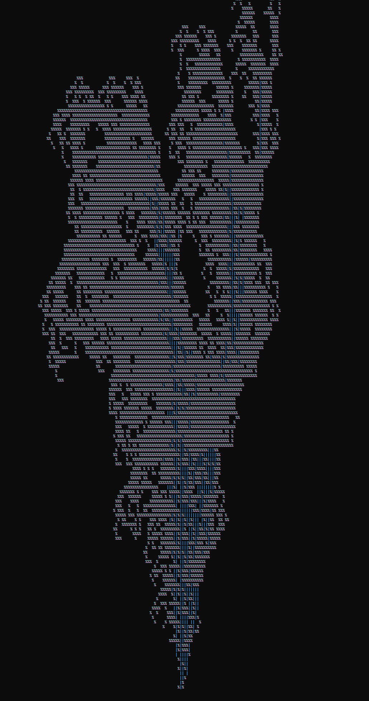

# Genetic Tree Generation

  

## Description
This code uses L-systems and a genetic algorithm that attempts to gradually draw a tree 
with the greatest height and symmetry from previous generations.

## Some variable info

| Variables            | Explanation                                                                     |
| ---------------------|:-------------------------------------------------------------------------------:|
| XSIZE                | Sets the x component of the world window size.                                  |
| YSIZE                | Sets the y component of the world window size.                                  |
| SCALE                | Sets the scale of the tree generation. Higher scale equates to greater detail.  |
| treeLength           | Length of each drawn branch.                                                    |
| initialStringSize    | The string length of L-systems generated.                                       |
| n                    | Size of population.                                                             |
| ITERATIONS           | How many times the rules of the L-system are applied to a given string.         |
| MUTATION_RATE        | Probability of mutation for each child string in a given generation.            |

### Selection
The selection process is based off of two criteria: symmetry and height. It measures symmetry by keeping track of drawn values to the left and right of the center. The height is measured by keeping track of the highest Y value recorded when drawing the tree (however, this has to be done somewhat backwards due to how pixel coordinates work). The most symmetric parent and the tallest parent are used for crossbreeding and mutation.

### Crossbreeding and mutation
The child string is initially set to the string of the symmetric parent, and then each character is iterated through and given a 50% probability to switch to the character of the height parent. Afterwards, the entire string is iterated through and there is a set probability that each character will mutate to another, randomly selected character. Once each child has been generated, the process restarts. The angle of each child can also mutate with the same probability set in the MUTATION_RATE variable.

### Rasterizing
The code uses a DDA line generation algorithm to rasterize lines within the console window. The implementation I used is from [GeeksforGeeks](https://www.geeksforgeeks.org/dda-line-generation-algorithm-computer-graphics/).

# More Images/Gifs
 
  
  

## Final notes
The idea behind this project is inspired and based off of [Gabriela Ochoa's paper](https://link.springer.com/chapter/10.1007/BFb0056876) on the subject. I strongly recommend reading her paper for more detailed information.
